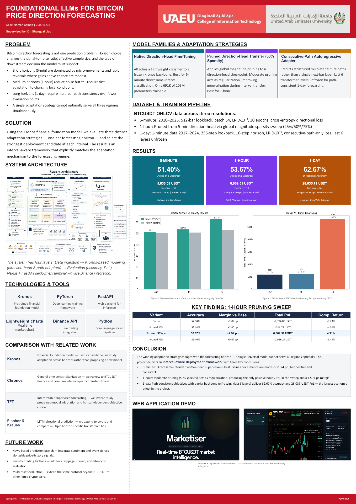

# Kronos BTC Directional Forecasting

[](LICENSE)
[](https://huggingface.co/abdelrahman964/kronos-finetuning)
[](https://www.python.org/)

An interval-aware adaptation study of the open-source
[Kronos](https://github.com/shiyu-coder/Kronos) financial foundation model for
BTCUSDT directional forecasting. The project compares native direction-head
fine-tuning, structured pruning, and path-consistent autoregressive adaptation
across 5-minute, 1-hour, and 1-day horizons.

This repository is the code, evaluation, and deployment companion to a Spring
2026 Senior Graduation Project II at the College of Information Technology,
United Arab Emirates University.

**Author:** Abdelrahman Osman<br>
**Supervisor:** Dr. Shengcai Liao

## Project resources

- [Public model weights and model card](https://huggingface.co/abdelrahman964/kronos-finetuning)
- [Editable PowerPoint research poster](docs/Kronos_Research_Poster.pptx)
- [Poster preview](docs/Kronos_Research_Poster.png)
- [Experimental results and supporting tables](reports/sgp2_extension_20260405/REPORT.md)
- [Weight inventory and checksums](MODEL_WEIGHTS.md)
- [Reproducibility guide](REPRODUCIBILITY.md)

## Main results

| Horizon | Selected adaptation | Evaluation window | N | Accuracy | Majority baseline | Margin | Frictionless 1 BTC PnL |
|---|---|---:|---:|---:|---:|---:|---:|
| 5 minutes | Native direction head | 2026-01-01 to 2026-03-09 | 19,554 | **51.40%** | 50.16% | +1.24 pp | +5,836.58 USDT |
| 1 hour | 50% pruned direction head | 2026-01-01 to 2026-03-04 | 1,498 | **53.67%** | 50.73% | +2.94 pp | +6,069.51 USDT |
| 1 day | Last-6-layer consecutive-path adapter | 2026-01-01 to 2026-03-16 | 75 | **62.67%** | 53.33% | +9.33 pp | +28,035.71 USDT |

The PnL figures are research backtests with a fixed 1 BTC position. They do not
include fees, spread, slippage, latency, liquidity constraints, or market
impact. They are not live-trading returns.

The daily result is the best observed snapshot, not a claim of universal
generalization. Extending that evaluation to 88 rows through 2026-03-29 reduced
accuracy to **57.95%**, versus a **56.82%** majority baseline. The saved raw
tables and later stress tests are retained so the headline result can be
audited in context.

## Technical contribution

- **5-minute forecasting:** direct same-interval classification produced a
  modest but positive advantage over the majority baseline.
- **1-hour forecasting:** a dense / 25% / 50% / 75% pruning sweep identified
  50% sparsity as the strongest hourly setting. It was the only sweep member
  with positive frictionless PnL and it reduced long-side prediction bias.
- **1-day forecasting:** a consecutive-path objective with the last six
  transformer layers unfrozen outperformed shallower and hybrid alternatives
  in the saved screening experiment.
- **Deployment:** Flask, Plotly, FastAPI, and Next.js prototypes connect saved
  models to market-data visualization and paper-trading workflows.

## Model availability

All eleven saved weight files from the supplied project archive are public on
[Hugging Face](https://huggingface.co/abdelrahman964/kronos-finetuning), including
the three selected horizon winners, supporting base/tokenizer checkpoints, and
experimental 1-minute checkpoints. The inventory records source provenance,
byte size, and SHA-256 for every file. One rollout checkpoint is byte-identical
to its corresponding best checkpoint; both paths are retained for archive
completeness.

GitHub intentionally remains lightweight. Model binaries are distributed from
Hugging Face, while source code, figures, raw evaluation outputs, and the poster
remain reviewable here.

## Repository structure

| Path | Purpose |
|---|---|
| `model/` | Kronos model, tokenizer, and predictor implementation |
| `finetune/` | Upstream-style fine-tuning pipeline |
| `finetune_csv/` | BTCUSDT training, pruning, and evaluation workflows |
| `reports/` | Experiment tables, figures, metrics, and raw predictions |
| `webui/` | Flask and Plotly research interface |
| `marketiser/` | FastAPI and Next.js deployment prototype |
| `trading/` | Paper-trading and opt-in exchange-execution scaffolding |
| `docs/` | Original research poster in editable and preview formats |

## Reproduction

Create a Python 3.10+ environment and install the project dependencies:

```bash
python -m venv .venv
source .venv/bin/activate  # Windows: .venv\Scripts\activate
pip install -r requirements.txt
```

Download public BTCUSDT candles for a declared interval and date range:

```bash
python finetune_csv/download_klines.py \
  --symbol BTCUSDT \
  --interval 5m \
  --start 2018-01-01 \
  --end 2026-01-01 \
  --output finetune_csv/data/BTCUSDT_kline_5min_2018_2025.csv
```

Then download the checkpoints from Hugging Face and follow
[`REPRODUCIBILITY.md`](REPRODUCIBILITY.md) for the evaluation entry points,
splits, checksums, and expected outputs.

## Credentials and live trading

No exchange credentials are distributed. Public market-data download and model
evaluation do not require Binance keys. Live execution is disabled by default;
users who deliberately enable it must supply their own credentials locally via
environment variables and should begin with paper trading.

## Research poster

[Download the original editable PowerPoint poster](docs/Kronos_Research_Poster.pptx)



## Limitations

- The experiments cover one trading pair and do not establish performance on
  other assets or market regimes.
- Each horizon uses a different evaluation window and sample count, so the
  percentages are not direct like-for-like comparisons.
- Model selection and repeated experimentation can inflate observed results.
- The backtests omit realistic execution frictions and capital constraints.
- The deployment interfaces are research prototypes rather than audited
  production trading systems.

## Upstream and attribution

This work adapts **Kronos: A Foundation Model for the Language of Financial
Markets** by Yu Shi and collaborators. See the
[upstream repository](https://github.com/shiyu-coder/Kronos),
[paper](https://arxiv.org/abs/2508.02739), and
[model collection](https://huggingface.co/NeoQuasar). The upstream MIT license
is retained. [`NOTICE`](NOTICE) identifies the derivative-work boundary.

If this repository supports academic work, cite both the upstream Kronos paper
and this project using [`CITATION.cff`](CITATION.cff).

## License

Released under the [MIT License](LICENSE). Model users should also review the
licenses and terms of the upstream Kronos checkpoints and any market-data
provider they use.
