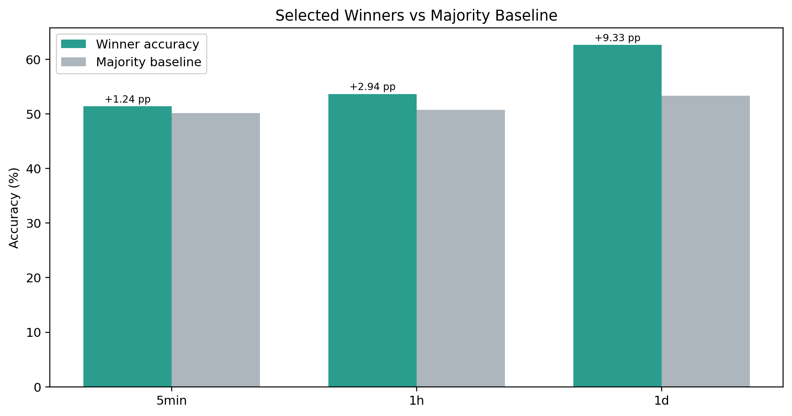
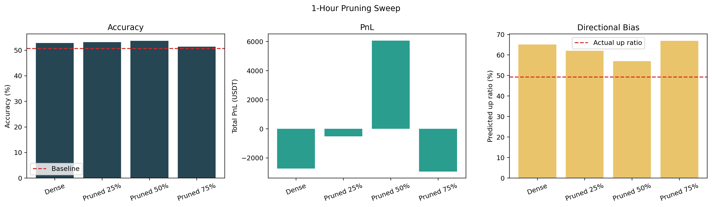
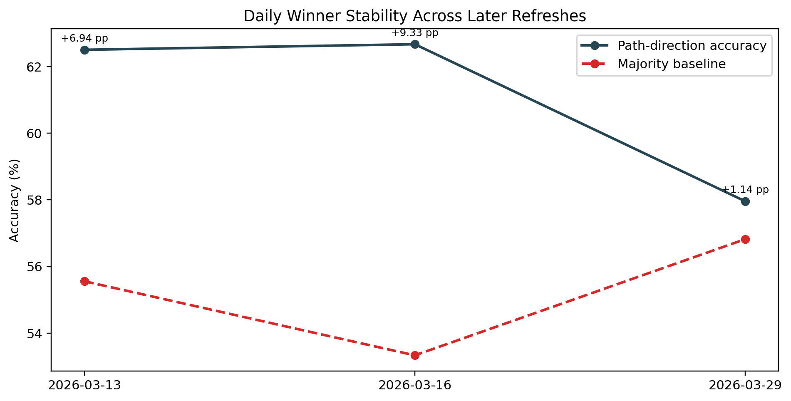
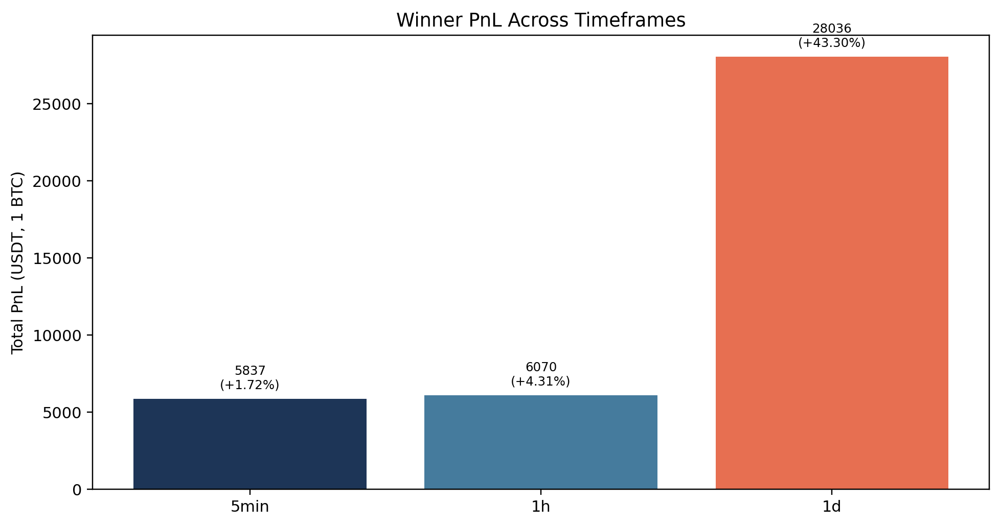

# Experimental Results and Evaluation

**Project:** Kronos BTC Directional Forecasting 
**Author:** Abdelrahman Osman 
**Supervisor:** Dr. Shengcai Liao 
**Institution:** College of Information Technology, United Arab Emirates University 
**Academic term:** Spring 2026

## Abstract

This study evaluates whether one adaptation strategy can serve Bitcoin
directional forecasting across short, medium, and daily horizons. It keeps the
Kronos financial foundation-model family fixed while varying the downstream
adaptation mechanism. A native direction head is evaluated at 5 minutes, a
structured-pruning sweep is evaluated at 1 hour, and a path-consistent adapter
with partial backbone unfreezing is evaluated at 1 day.

The selected models reached 51.40%, 53.67%, and 62.67% directional accuracy at
the three respective horizons. The hourly result provides the clearest ablation
finding: 50% pruning produced the highest accuracy, the smallest long-side bias,
and the only positive frictionless PnL in the dense / 25% / 50% / 75% sweep. The
daily model produced the largest best-window margin, but a later extension shows
that its advantage narrowed substantially. The evidence supports horizon-aware
adaptation rather than a claim that one model is uniformly best.

## Research question

Given a pretrained financial sequence model, which downstream adaptation method
is most effective for BTCUSDT direction forecasting at 5-minute, 1-hour, and
1-day horizons?

The study evaluates three corresponding mechanisms:

1. Native same-interval direction-head fine-tuning for 5-minute prediction.
2. Global magnitude pruning followed by direction-head transfer for 1-hour
   prediction.
3. A consecutive-path objective with the last six transformer layers unfrozen
   for 1-day prediction.

The system mapping and checkpoint provenance are documented in
[`three_model_system_architecture.md`](three_model_system_architecture.md).

## Primary results

| Horizon | Selected model | Evaluation window | Rows | Accuracy | Majority baseline | Margin | Frictionless 1 BTC PnL |
|---|---|---:|---:|---:|---:|---:|---:|
| 5 minutes | Native direction head | 2026-01-01 to 2026-03-09 | 19,554 | **51.40%** | 50.16% | +1.24 pp | +5,836.58 USDT |
| 1 hour | 50% pruned direction head | 2026-01-01 to 2026-03-04 | 1,498 | **53.67%** | 50.73% | +2.94 pp | +6,069.51 USDT |
| 1 day | Last-6-layer path adapter | 2026-01-01 to 2026-03-16 | 75 | **62.67%** | 53.33% | +9.33 pp | +28,035.71 USDT |

Source table: [`selected_winners_summary.csv`](selected_winners_summary.csv)

The horizons use different windows and sample counts. The table therefore
summarizes each horizon's selected deployment candidate; it is not a controlled
comparison in which only the horizon changes.

## Five-minute model

The native 5-minute direction-head checkpoint is the best saved short-horizon
candidate in the benchmark snapshot:

- Accuracy: 51.40%
- Majority baseline: 50.16%
- Margin: +1.24 percentage points
- Rows: 19,554
- Window: 2026-01-01 to 2026-03-09

The result supports a narrow conclusion. Same-interval supervision produced a
positive edge, but its 1.24-point advantage is modest. The saved legacy baseline
comparisons are available in
[`legacy_5min_baselines.csv`](legacy_5min_baselines.csv).

## One-hour pruning ablation

The hourly pruning sweep is the most interpretable controlled experiment in the
project.

| Variant | Accuracy | Margin vs baseline | Predicted-up gap | Frictionless 1 BTC PnL |
|---|---:|---:|---:|---:|
| Dense | 52.80% | +2.07 pp | +15.82 pp | -2,726.83 USDT |
| Pruned 25% | 53.14% | +2.40 pp | +12.82 pp | -516.73 USDT |
| **Pruned 50%** | **53.67%** | **+2.94 pp** | **+7.74 pp** | **+6,069.51 USDT** |
| Pruned 75% | 51.40% | +0.67 pp | +17.62 pp | -2,936.27 USDT |

Source table: [`hourly_pruning_sweep.csv`](hourly_pruning_sweep.csv)

Moderate sparsification improved the classification result while suppressing
the upward-prediction bias observed in the dense and heavily pruned variants.
The 50% checkpoint was also the only member of this sweep with positive
frictionless PnL.

## One-day path-adapter study

The selected daily model combines a pure consecutive-path objective, an output
adapter, and last-six-layer backbone unfreezing. It reached 62.67% accuracy on
75 rows through 2026-03-16, compared with a 53.33% majority baseline.

The saved daily screening shows that the last-six-layer configuration
outperformed the shallower and hybrid alternatives. The full ablation values
are retained in
[`daily_screening_summary.csv`](daily_screening_summary.csv) and visualized in
[`daily_model_screening.png`](daily_model_screening.png).

### Generalization extension

| Window end | Rows | Accuracy | Baseline | Margin |
|---|---:|---:|---:|---:|
| 2026-03-13 | 72 | 62.50% | 55.56% | +6.94 pp |
| 2026-03-16 | 75 | 62.67% | 53.33% | +9.33 pp |
| 2026-03-29 | 88 | 57.95% | 56.82% | +1.14 pp |

Source table: [`daily_winner_extension.csv`](daily_winner_extension.csv)

The later window remained slightly above its majority baseline, but the margin
fell from 9.33 to 1.14 percentage points. The 62.67% result should therefore be
read as the best observed snapshot among the tested daily configurations rather
than evidence of stable performance under all later market conditions.

## Economic metric assumptions

The PnL values use a fixed 1 BTC position and frictionless execution. They omit:

- commissions and exchange fees
- bid-ask spread and slippage
- latency and partial fills
- liquidity, capital, and position-size constraints
- funding, borrowing costs, and market impact

These figures help compare saved signals under one simplified arithmetic rule.
They do not estimate deployable or guaranteed trading returns.

## Artifacts and audit trail

The repository includes the following directly inspectable evidence:

- [`selected_winners_summary.csv`](selected_winners_summary.csv): headline
  horizon results and exact evaluation windows
- [`hourly_pruning_sweep.csv`](hourly_pruning_sweep.csv): dense and pruned
  hourly variants
- [`daily_screening_summary.csv`](daily_screening_summary.csv): daily objective
  and unfreezing ablations
- [`daily_winner_extension.csv`](daily_winner_extension.csv): later daily
  generalization window
- [`later_experiments_summary.csv`](later_experiments_summary.csv): follow-up
  experiments that did not replace the selected snapshot
- [`../ad_hoc_20260409/cross_timeframe_direction_heads_2026-04-08/`](../ad_hoc_20260409/cross_timeframe_direction_heads_2026-04-08/): raw metrics,
  raw predictions, curves, and a later cross-timeframe evaluation

All saved model weights, configs, byte sizes, and SHA-256 values are public in
the [Hugging Face model repository](https://huggingface.co/abdelrahman964/kronos-finetuning).
The root [`REPRODUCIBILITY.md`](../../REPRODUCIBILITY.md) documents the download
and evaluation entry points.

## Deployment prototype

The project includes a Flask and Plotly interface in `webui/`, plus a FastAPI
and Next.js prototype in `marketiser/`. These interfaces support market-data
visualization and model-driven experimentation. The trading components default
to research and paper-trading use; live exchange credentials are not included.

## Related work and positioning

The contribution is an adaptation study rather than a new foundation model.
[Kronos](https://arxiv.org/abs/2508.02739) provides the pretrained financial
backbone. [Chronos](https://arxiv.org/abs/2403.07815) studies pretrained
tokenized time-series models across broader forecasting tasks. The
[Temporal Fusion Transformer](https://arxiv.org/abs/1912.09363) focuses on a
new interpretable multi-horizon architecture. This project instead holds the
backbone family fixed and asks which adaptation mechanism best fits each target
horizon. BibTeX entries are available in [`references.bib`](references.bib).

## Conclusion

The saved experiments indicate that the preferred adaptation changes with the
forecast horizon. Native direction classification was most competitive at 5
minutes, moderate pruning produced the clearest hourly improvement, and a
path-consistent partially unfrozen adapter achieved the strongest daily
snapshot. The later daily extension also demonstrates why evaluation-window
scope and generalization caveats must remain visible beside headline results.

The practical contribution is a reproducible horizon-aware model-selection
study with public checkpoints, raw evidence, integrity hashes, and deployment
prototypes.
